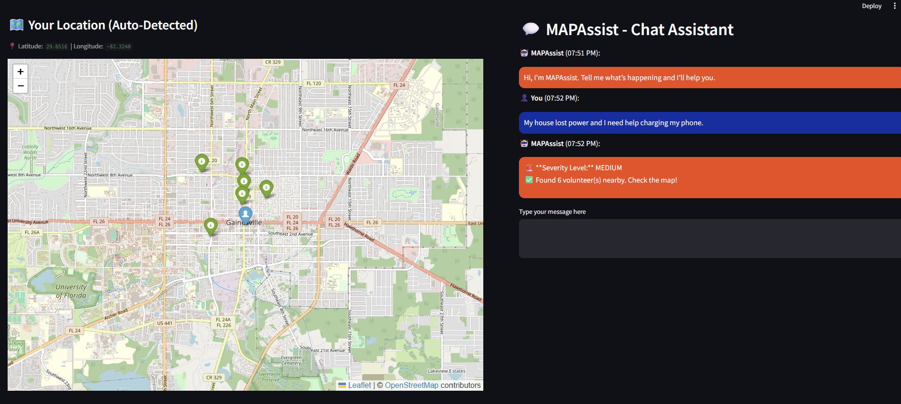

# 🌍 MAPAssist - Disaster Help Assistant



> MAPAssist is an AI-powered web app that supports people in distress during a disaster. Using location detection and severity classification, it connects users with community volunteers, mental health support, or emergency response as needed.

## 🚀 Features

- 🤖 AI-powered chatbot interface
- 📍 Auto-detects user location (IP-based)
- 📊 Severity classification (Low / Medium / Critical)
- 🗺️ Interactive disaster and volunteer map
- 🧠 Mental health support suggestions
- 🧑‍🤝‍🧑 Community-powered help via nearby volunteers
- 🗂️ Chat history and timestamps

## 🛠️ Installation

```bash
# 1. Clone the repository
git clone https://github.com/your-username/mapassist.git
cd mapassist

# 2. Create and activate a virtual environment
python3 -m venv venv
source venv/bin/activate  # On Windows use `venv\Scripts\activate`

# 3. Install dependencies
pip install -r requirements.txt

# 4. Run the app
streamlit run app.py
```

Then open: `http://127.0.0.1:8501`

## 🧭 Application Flow

1. **Detect User Location**
   - App tries to auto-detect user's latitude & longitude using IP.
2. **Start Chat (via chatbot interface)**
   - Users type in their concern.
3. **Classify Severity**
   - Critical: Urged to call 911.
   - Medium: Shows nearby community volunteers on a map.
   - Low: Provides resource links and mental health support.
4. **Guide or Redirect Accordingly**
   - Users receive location-based assistance, updated on the map.

## 💡 What It Does

MAPAssist guides users based on their needs:
- Shows **nearest disaster events** if threat is critical.
- Connects them to **nearby volunteers** for medium-level issues.
- Offers **resource center and mental health support** for low-level concerns.

Each response is geolocated, LLM-enhanced, and personalized.

## 🧱 Built With

- Streamlit
- Hugging Face Transformers (Falcon-7B-Instruct)
- Python, HTML, CSS
- Folium for Map Rendering
- IPInfo API for IP-based geolocation

## 🔮 Future Roadmap

- [ ] 📷 Allow geo-tagged image uploads
- [ ] 🧠 Heatmaps for disaster & mental distress zones
- [ ] 🛰️ Natural disaster prediction
- [ ] 🤝 Integrate with local authorities & emergency responders
- [ ] 📝 Volunteer onboarding and profile system

## 🙌 Acknowledgements

- Hugging Face for Falcon-7B-Instruct
- Streamlit for intuitive UI building
- IPInfo for IP-based location services
- OpenStreetMap contributors for map data

